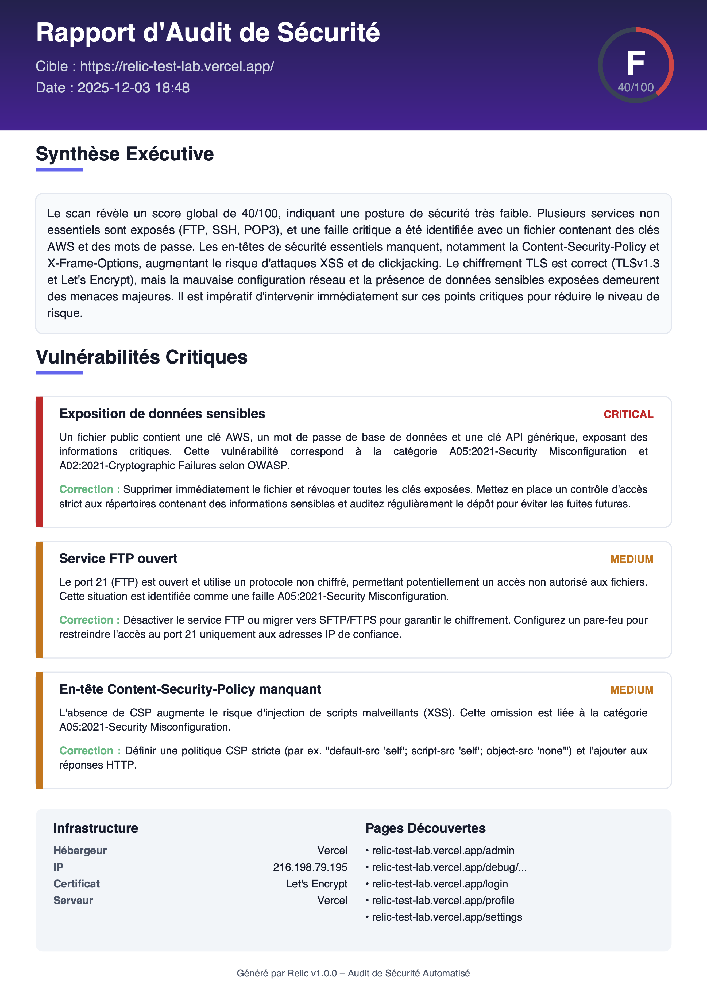
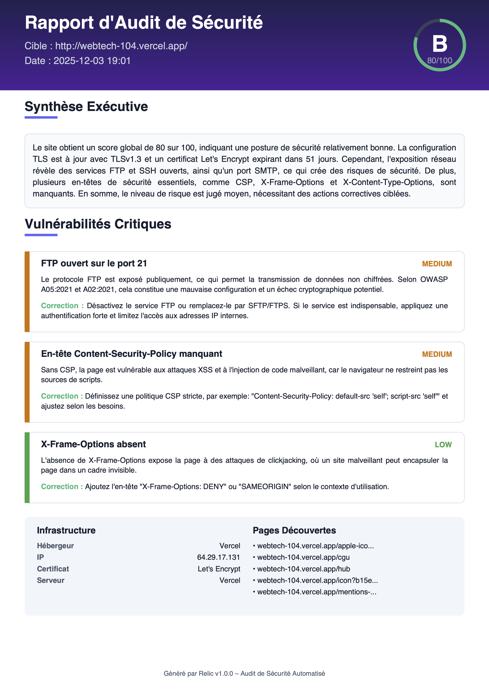

# Relic / AuditAI

**Scanner de sécurité web avec interface temps réel et rapports IA.**

Ce projet est un prototype fonctionnel réalisé dans le cadre d'un test technique. Il propose une approche moderne de l'audit de sécurité : au lieu d'un simple script, l'outil expose une **interface Web réactive** pour suivre les scans en direct, tout en conservant un **CLI** robuste pour l'automatisation.

---

## Architecture & Structure du Projet

Le projet est conçu comme un monorepo moderne, séparant clairement le frontend, le backend et l'infrastructure.

```
.
├── apps/
│   └── web/               # Frontend Next.js (Interface Web)
│       ├── app/           # Pages et Routing (App Router)
│       ├── components/    # Composants React (Terminal, Logs, UI)
│       └── lib/           # Utilitaires et API client
├── services/
│   └── scanner/           # Backend Python (Cœur du système)
│       ├── app/
│       │   ├── cli.py     # Point d'entrée CLI (Command Line Interface)
│       │   ├── main.py    # Point d'entrée API (FastAPI)
│       │   ├── scanner/   # Moteur de scan (engine, checks, crawler...)
│       │   ├── ai/        # Intégration LLM (Ollama / OpenRouter)
│       │   └── pdf/       # Générateur de rapports PDF (ReportLab)
│       ├── Dockerfile     # Image Docker du scanner
│       └── requirements.txt
├── docker-compose.yml     # Orchestration des services (Web + Scanner)
└── README.md
```

**Flux de données (Pipeline de Scan) :**


1.  **Input** : L'utilisateur lance un scan via le Web ou le CLI.
2.  **Engine** : Le moteur Python orchestre les modules de scan (réseau, HTTP, vulnérabilités).
3.  **Streaming** : Les logs sont envoyés en temps réel au frontend via SSE (Server-Sent Events).
4.  **IA** : Les résultats bruts sont analysés par le LLM pour générer la synthèse.
5.  **Output** : Un rapport PDF complet est généré et mis à disposition.

---

## Fonctionnalités Détaillées

### 1. Interface Web (Dashboard)
C'est le point fort du projet pour l'expérience utilisateur.
- **Lancer des scans** : Saisie simple de l'URL cible.
- **Logs en temps réel** : Visualisation "Matrix-style" des actions du scanner via SSE.
- **Rapport IA intégré** : Lecture directe de la synthèse, du score et des recommandations.
- **Téléchargement PDF** : Récupération du rapport final en un clic.


### 2. Outil CLI (Command Line)
Pour l'intégration CI/CD ou l'usage serveur.
- **Scan "headless"** : Exécution complète sans interface graphique.
- **Mode Interactif** : Prompt utilisateur si aucune cible n'est fournie.
- **Rapport PDF** : Génération identique à la version Web.


### 3. Moteur de Scan (Scanner Engine)
Le cœur technique (`services/scanner`) implémente les vérifications suivantes :

*   **Reconnaissance & Infra** :
    *   Résolution DNS et vérification de la connectivité.
    *   **WAF Detection** : Détection basique des blocages (403, headers spécifiques).
    *   **Port Scan** : Vérification rapide des 12 ports les plus critiques (FTP, SSH, HTTP, HTTPS, DBs...).
    *   **Crawler** : Exploration des pages (limité à une profondeur de 2) pour découvrir la surface d'attaque.

*   **Analyse HTTP & Sécurité** :
    *   **Headers** : Vérification des en-têtes de sécurité (HSTS, CSP, X-Frame-Options...).
    *   **Cookies** : Analyse des attributs `Secure`, `HttpOnly`, `SameSite`.
    *   **TLS/SSL** : Validation du certificat, de l'émetteur et de la date d'expiration.

*   **Vulnérabilités (Vulnerability Checks)** :
    *   **Sensitive Files** : Recherche de fichiers exposés (`.env`, `.git`, backups, logs...).
    *   **XSS (Reflected)** : Détection de patterns d'injection dans les paramètres URL.
    *   **SQL Injection** : Tests basiques d'injection SQL (Time-based & Error-based).
    *   **CORS** : Détection des configurations "Wildcard" dangereuses.

*   **Intelligence Artificielle (AI Analysis)** :
    *   Synthèse exécutive en français.
    *   Calcul du Score de Sécurité (0-100) et de la Note (A-F).
    *   Top 3 des vulnérabilités avec explications vulgarisées et techniques.
    *   Recommandations de remédiation concrètes.

*   **Extensible par design** : Ajout facile de nouveaux modules de scan et de règles de détection grâce à une architecture modulaire.

---

## Mise à jour de la base de vulnérabilités

La base de vulnérabilités de Relic n’est pas figée : elle est conçue comme un ensemble de règles techniques modulaires qui peuvent être enrichies progressivement en fonction du contexte métier et des nouveaux besoins de sécurité.

Les règles sont définies programmatiquement dans le dossier `services/scanner/app/scanner/` :
- **Logique de détection** : `vuln_checks.py` contient les fonctions de vérification (ex: `check_xss_url`, `check_sqli_url`).
- **Payloads & Signatures** : Les listes de payloads (XSS, SQLi) et les signatures d'erreurs sont gérées dans des modules dédiés (ex: `xss_detector.py`) ou directement dans les fonctions de check.

**Pour ajouter une nouvelle règle :**
1.  **Créer ou modifier** une fonction de check dans `vuln_checks.py`.
2.  **Définir les payloads** ou les patterns à détecter (ex: ajout d'une nouvelle signature de fichier sensible).
3.  **Enregistrer la vérification** dans l'orchestrateur `engine.py` pour qu'elle soit exécutée lors du scan.
4.  **Versionner** simplement les changements via Git pour mettre à jour la base de connaissances de l'équipe.

---

## Extensibilité des scans & modes agressifs

Relic est structuré pour permettre l'ajout de nouveaux modules de scan sans altérer le cœur du système.

- **Architecture Modulaire** : Chaque scanner est un module indépendant ou une fonction asynchrone invoquée par le `ScanEngine`.
- **Modes Agressifs (Optionnels)** :
    - L'architecture permet l'intégration de scans plus offensifs (fuzzing intense, bruteforce de répertoires, scan de ports complet).
    - Ces modes doivent être activés explicitement (via des flags futurs) pour éviter de perturber les services en production.

> **Note** : Par défaut, Relic privilégie des scans non destructifs et raisonnables, adaptés à un contexte d’audit de sécurité sur des environnements de production, avec la possibilité d’activer des modes plus intrusifs dans un cadre légal et contrôlé.

---

## Couverture OWASP 2021

Relic n'est pas un audit de sécurité exhaustif, mais son moteur s'aligne sur plusieurs catégories critiques de l'**OWASP Top 10 2021** pour détecter les failles les plus courantes :

*   **A01:2021 – Broken Access Control**
    *   Exposition de services sensibles (ports de base de données ouverts, endpoints admin non protégés).
*   **A02:2021 – Cryptographic Failures**
    *   HTTPS non imposé, protocoles non chiffrés (FTP, POP3 sans TLS), configurations TLS faibles ou certificats expirés.
*   **A03:2021 – Injection**
    *   Détection basique de XSS réfléchie (Reflected XSS) et d’injections SQL (Error-based & Time-based).
*   **A05:2021 – Security Misconfiguration**
    *   Fichiers sensibles (.env, dumps, configs) exposés, headers de sécurité manquants (HSTS, CSP), services inutiles exposés.

> **Note** : La couverture est partielle et optimisée pour la démonstration et l'éducation.

---

## Tech Stack

Le projet repose sur une pile technique moderne et robuste :

**Backend / Scanner (Python)**
*   `fastapi` : API HTTP asynchrone performante pour piloter les scans et exposer les endpoints.
*   `httpx` : Client HTTP asynchrone utilisé pour le scan des URLs, l'analyse des headers et les tests de vulnérabilités.
*   `pydantic` / `sqlmodel` : Modèles de données typés pour la validation stricte et la persistance.
*   `typer` : Création d'une CLI ergonomique et intuitive.
*   `reportlab` : Moteur de génération des rapports PDF vectoriels.
*   `beautifulsoup4` : Parsing HTML pour le crawler et l'analyse de contenu.
*   `asyncio` : Orchestration asynchrone native pour paralléliser les tâches de scan.

**Frontend / Web UI**
*   `next` / `react` : Framework React pour une interface réactive (App Router) et le rendu côté serveur.
*   `typescript` : Typage statique pour une meilleure maintenabilité du code frontend.
*   `tailwindcss` : Framework CSS utilitaire pour un design rapide et cohérent.
*   `framer-motion` : Gestion des animations fluides (loaders, transitions).
*   `lucide-react` : Bibliothèque d'icônes vectorielles légères.

**Infra / Outillage**
*   `docker` / `docker-compose` : Conteneurisation et orchestration des services pour un déploiement iso-prod.

---

## Installation & Démarrage

La méthode recommandée est **Docker Compose** pour une stack complète et isolée.

```bash
# 1. Cloner le projet
git clone https://github.com/elishab60/relic.git
cd relic

# 2. Lancer la stack
docker compose up -d --build
```

Une fois lancé :
- **Web UI** : [http://localhost:3000](http://localhost:3000)
- **API Docs** : [http://localhost:8000/docs](http://localhost:8000/docs)

---

## Utilisation

### Via l'Interface Web (Recommandé)
1. Ouvrez [http://localhost:3000](http://localhost:3000).
2. Entrez l'URL cible (ex: `https://webtech-104.vercel.app`).
3. Suivez l'avancement dans la console de logs.
4. Téléchargez le rapport PDF une fois l'analyse terminée.

### Via le CLI (Docker)
Utilisez le conteneur `scanner` pour lancer des audits en ligne de commande :

```bash
# Mode interactif (recommandé)
docker compose exec -it scanner python -m app.cli scan --pdf-out report.pdf
```

Pour récupérer le fichier PDF généré sur votre machine hôte :
```bash
docker compose cp scanner:/app/report.pdf ./report.pdf
```

---

## Configuration

Le projet est "batteries included". Les valeurs par défaut sont optimisées pour un usage standard.
Vous pouvez surcharger ces variables dans le `docker-compose.yml` :

| Variable | Description | Valeur par défaut |
|----------|-------------|-------------------|
| `OLLAMA_BASE_URL` | URL de l'instance Ollama (pour IA locale) | `http://localhost:11434` |
| `OLLAMA_MODEL` | Modèle Ollama à utiliser | `gpt-oss:20b` |
| `OPENROUTER_API_KEY` | Clé API pour OpenRouter (si pas d'Ollama) | *Vide* |
| `OPENROUTER_MODEL` | Modèle OpenRouter à utiliser | `x-ai/grok-4.1-fast:free` |
| `SCANNER_DEFAULT_TIMEOUT` | Timeout HTTP global (secondes) | `10.0` |

### Recommandations Matérielles (IA Locale)

L'utilisation d'Ollama en local dépend fortement de votre GPU/RAM. Voici un guide détaillé pour choisir le bon modèle :

| Configuration Type | GPU / NPU | RAM / VRAM | Modèle Conseillé | Quantization | Perf. Estimée |
| :--- | :--- | :--- | :--- | :--- | :--- |
| **Mac Studio / Pro** | M1/M2/M3 Ultra | 64Go+ | `llama3:70b` | Q4_K_M | **Excellente** (< 20s) |
| **MacBook Pro (High)** | M1/M2/M3 Max | 32Go+ | `gpt-oss:20b` | Q4_K_M | **Très Bonne** (~25s) |
| **PC Gamer (High)** | RTX 4090 / 3090 | 24Go VRAM | `gpt-oss:20b` | Q4_K_M | **Très Bonne** (~20s) |
| **MacBook Pro (Mid)** | M1/M2/M3 Pro | 16Go | `mistral:7b` / `llama3:8b` | Q5_K_M | **Bonne** (~15s) |
| **PC Gamer (Mid)** | RTX 4070 / 3060 | 12Go VRAM | `mistral:7b` / `gemma:7b` | Q5_K_M | **Bonne** (~10s) |
| **MacBook Air / PC** | M1/M2 / Integr. | 8Go | *Déconseillé en local* | - | *Lent / OOM* |

> **⚠️ Important** : Pour un rapport de sécurité pertinent, nous recommandons au minimum un modèle **7B ou 8B** (Mistral, Llama3). Les modèles plus petits (TinyLlama, Phi-2) "hallucinent" trop souvent des vulnérabilités ou ratent le contexte.
>
> **Si votre matériel est insuffisant** : Configurez `OPENROUTER_API_KEY` pour utiliser un modèle Cloud performant sans ralentir votre machine.

---

## Roadmap & futures évolutions

Voici les fonctionnalités prévues pour les prochaines versions de Relic, visant à en faire un outil d'audit encore plus complet :

-   **Couverture OWASP élargie**
    > Étendre la couverture des tests pour couvrir davantage de catégories OWASP Top 10 (authentification, gestion de session, validation des entrées côté serveur, etc.).

-   **Scans authentifiés**
    > Support de sessions authentifiées (cookies, tokens, headers personnalisés) pour tester des parties de l'application non accessibles en anonyme.

-   **Intégration de scanners externes**
    > Intégration optionnelle avec des outils comme `nmap` ou d'autres scanners réseau pour enrichir la cartographie de l'attaque.

-   **Modes de scan avancés**
    > Modes "rapide", "standard" et "profond", avec différents niveaux de granularité et de charge sur la cible.

-   **Planification & historique**
    > Ajout d'une planification de scans (scheduler) et d'un historique consultable (via la WebApp ou des fichiers JSON/rapports stockés).

-   **API & intégration CI/CD**
    > Exposition d'une API ou d'une interface CLI plus complète pour intégrer Relic dans des pipelines CI/CD de sécurité.

---

## Limites Connues

Ce projet est un prototype avancé, mais il a ses limites par rapport à des outils commerciaux :
- **Scan de ports** : Restreint à une liste fixe pour la performance, ne remplace pas un scan Nmap complet.
- **Détection** : Les checks de vulnérabilités sont basés sur des signatures et des comportements simples, sans exploitation active complexe.
- **IA** : La qualité du rapport dépend du modèle utilisé.
    - **Ollama (Local)** : Moins puissant que les modèles cloud géants (GPT-5), mais offre une **confidentialité totale des données** (aucune donnée ne quitte votre infrastructure), ce qui est crucial en contexte de cybersécurité sensible.
    - **OpenRouter (Cloud)** : Plus performant pour la synthèse, mais implique l'envoi de métadonnées de scan à un tiers.

---

## Exemples de Résultats

Pour valider l'outil, j'ai effectué des tests sur des environnements contrôlés :

1.  **[Relic Test Lab](https://relic-test-lab.vercel.app)** : Un site volontairement vulnérable (failles XSS, headers manquants, secrets exposés) créé spécifiquement pour démontrer les capacités de détection de Relic.
    
    

2.  **[WebTech 104](https://webtech-104.vercel.app)** : Un projet étudiant que j'ai réalisé avec un camarade dans le cadre d'un projet de cours à l'ECE utilisé comme cible "standard" pour vérifier le comportement sur une application Next.js classique.

    

> **Note** : Cet outil a été testé exclusivement sur mes propres infrastructures et sur des projets open-source autorisés. Aucune cible non autorisée n'a été scannée durant le développement.

---

## Avertissement Légal

Relic est un outil de sécurité offensive destiné à des fins éducatives et d'audit légitime. L'utilisateur est seul responsable de l'utilisation de cet outil. Il est strictement interdit d'utiliser Relic sur des cibles sans l'autorisation explicite de leur propriétaire.
